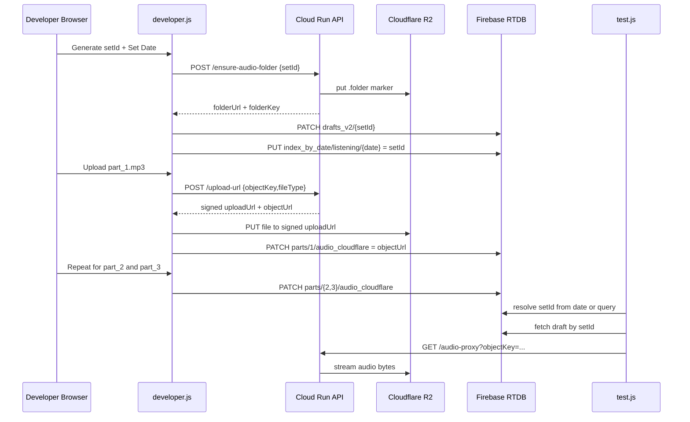

# Audio Upload System (Frontend + Backend + API)

This document explains the complete flow for uploading TOEFL listening audio from the website and storing it in the correct Cloudflare R2 folder path.

## 1) Goal

For each listening set, audio files must be uploaded to this exact folder structure:

- `audio/listening/sets/{setId}/part_1.mp3`
- `audio/listening/sets/{setId}/part_2.mp3`
- `audio/listening/sets/{setId}/part_3.mp3`

Where `setId` is generated from set date and metadata (example: `mocktest_listening_2026-08-03_1785587019897_zft2tp`).

## 2) Components

## Frontend (GitHub Pages)

- `index.html`: launcher page
- `developer.html` + `developer.js`: developer console for creating set metadata and uploading/validating audio
- `section 1.html` + `section 1_answered.html` + `developer.js`: test page for loading a set by `setId` or date index and playing audio
- `app-config.js`: public runtime config

### Frontend responsibilities

- Generate `setId`
- Create and save `cloudflare_folder` metadata in Firebase
- Call backend to ensure folder marker exists in R2
- Request signed upload URL from backend
- Upload audio file bytes directly to R2 using signed URL
- Save final public audio URL into Firebase under each part

## Backend (Cloud Run, FastAPI)

- Path: `gateway-backend/main.py`
- Runtime: Cloud Run service URL
- Storage adapter: `boto3` S3 client against Cloudflare R2 endpoint

### Backend responsibilities

- Validate inputs (`setId`, `objectKey`)
- Enforce allowed object key format for listening parts
- Create marker object for folder prefix
- Generate signed PUT URLs for exact object keys
- Optionally support direct multipart proxy upload
- Expose helper endpoints for existence and folder listing

## Data store (Firebase RTDB)

- Draft node: `/toefl_itp/drafts_v2/{setId}`
- Date index: `/toefl_itp/index_by_date/listening/{YYYY-MM-DD}` -> `setId`

## Object storage (Cloudflare R2)

- Public base URL: `https://pub-1975cb14188340238a5d6d34750e4880.r2.dev`
- Virtual folder prefix per set: `audio/listening/sets/{setId}/`
- Marker object for folder materialization: `.folder`

## 3) Runtime config used by frontend

`app-config.js` includes:

- `rtdbBaseUrl`
- `cloudflarePublicBase`
- `apiGatewayBase`
- `uploadEndpoint` (optional override)

Current upload flow defaults to signed URL endpoint:

- `{apiGatewayBase}/api/developer/upload-url`

Important: old saved values pointing to `/api/developer/upload-proxy` are auto-migrated in frontend code to `/api/developer/upload-url`.

## 4) API contract used for audio upload

## 4.1 Ensure folder endpoint

### POST `/api/developer/ensure-audio-folder`

Request:

```json
{
  "setId": "mocktest_listening_2026-08-03_1785587019897_zft2tp",
  "testType": "mocktest"
}
```

Behavior:

1. Validate `setId`
2. Create marker object at `audio/listening/sets/{setId}/.folder`
3. Return folder metadata and public folder URL

Response (example):

```json
{
  "setId": "mocktest_listening_2026-08-03_1785587019897_zft2tp",
  "folderKey": "audio/listening/sets/mocktest_listening_2026-08-03_1785587019897_zft2tp/",
  "folderUrl": "https://pub-...r2.dev/audio/listening/sets/mocktest_listening_2026-08-03_1785587019897_zft2tp/",
  "markerKey": "audio/listening/sets/mocktest_listening_2026-08-03_1785587019897_zft2tp/.folder",
  "createdAt": "2026-08-01T12:25:30.462Z"
}
```

## 4.2 Signed upload URL endpoint

### POST `/api/developer/upload-url`

Request:

```json
{
  "objectKey": "audio/listening/sets/mocktest_listening_2026-08-03_1785587019897_zft2tp/part_1.mp3",
  "fileName": "audio/listening/sets/mocktest_listening_2026-08-03_1785587019897_zft2tp/part_1.mp3",
  "fileType": "audio/mpeg"
}
```

Behavior:

1. Validate `objectKey` with strict regex:
   - `audio/listening/sets/{setId}/part_[1-3].mp3`
2. Generate signed PUT URL for that exact `objectKey`
3. Return signed URL + exact object key + public URL

Response (example):

```json
{
  "uploadUrl": "https://...signed-r2-put-url...",
  "objectKey": "audio/listening/sets/mocktest_listening_2026-08-03_1785587019897_zft2tp/part_1.mp3",
  "objectUrl": "https://pub-...r2.dev/audio/listening/sets/mocktest_listening_2026-08-03_1785587019897_zft2tp/part_1.mp3",
  "expiresIn": 900
}
```

Critical rule:

- Backend must not rewrite `objectKey` to timestamp/random path.

## 4.3 Optional direct proxy upload endpoint

### POST `/api/developer/upload-proxy`

Form fields:

- `file` (binary)
- `objectKey`
- `fileType`

Behavior:

1. Validate `objectKey` with same strict format
2. Upload file bytes to exact key
3. Return `objectUrl`

Note:

- Frontend main flow uses `/upload-url` + direct PUT to R2.
- `/upload-proxy` remains optional and expects multipart form-data, not JSON.

## 4.4 Helper endpoints

- `GET /api/developer/audio-url?objectKey=...`
- `GET /api/developer/audio-proxy?objectKey=...`
- `GET /api/developer/audio-exists?objectKey=...`
- `GET /api/developer/audio-folder-contents?setId=...`

`audio-proxy` is the recommended playback route when you want to avoid depending on the public `r2.dev` hostname.

## 5) End-to-end upload flow (developer page)

1. User sets date and metadata.
2. Frontend generates `setId`.
3. Frontend builds `cloudflare_folder` as:
   - `{cloudflarePublicBase}/audio/listening/sets/{setId}`
4. Frontend calls `ensure-audio-folder`.
5. Frontend saves folder metadata to Firebase draft + date index.
6. For each part (1,2,3):
   - Build exact `objectKey` from `setId` and part number
   - Call `upload-url` to get signed PUT URL
   - PUT MP3 bytes to returned signed URL
   - Save returned `objectUrl` to Firebase at `parts/{n}/audio_cloudflare`
7. Test page resolves set by `setId` or date and uses part URLs for playback.
8. When API playback is enabled, the test page loads MP3s from `/api/developer/audio-proxy` instead of the public R2 URL.

## 6) Sequence diagram



## 7) Firebase data shape (simplified)

```json
{
  "id": "mocktest_listening_2026-08-03_1785587019897_zft2tp",
  "setId": "mocktest_listening_2026-08-03_1785587019897_zft2tp",
  "setDate": "2026-08-03",
  "cloudflare_folder": "https://pub-.../audio/listening/sets/mocktest_listening_2026-08-03_1785587019897_zft2tp",
  "parts": [
    null,
    { "audio_cloudflare": "https://pub-.../part_1.mp3" },
    { "audio_cloudflare": "https://pub-.../part_2.mp3" },
    { "audio_cloudflare": "https://pub-.../part_3.mp3" }
  ]
}
```

## 8) Common errors and fixes

## 404 in browser console

Possible causes:

- Wrong endpoint path in frontend config
- Old cached script/HTML

Fix:

- Hard refresh browser
- Confirm `apiGatewayBase` in `app-config.js`

## 422 on signed URL request

Most common causes:

- Frontend accidentally calling `/upload-proxy` with JSON body
- Invalid `objectKey` format
- Missing `objectKey`

Fix:

- Ensure endpoint is `/api/developer/upload-url`
- Ensure object key is exactly `audio/listening/sets/{setId}/part_[1-3].mp3`

## Cloud Run startup fails with port error message

Common real causes (seen in logs):

- Missing or malformed R2 env vars (`R2_ACCOUNT_ID`, etc.)

Fix:

- Set all required env vars on deploy
- Verify values are not literal placeholders like `$R2_ACCOUNT_ID`

## 9) Security and ops notes

- Never place R2 secrets in frontend files.
- Rotate R2 credentials if they are ever exposed in logs or chat.
- Prefer Cloud Run secret integration (Secret Manager) for production.
- Keep CORS restricted to known origins (GitHub Pages + local dev origins).

## 10) Quick verification checklist

1. `GET /health` returns ok.
2. `POST /ensure-audio-folder` returns folder URL with setId.
3. `POST /upload-url` returns same objectKey that was requested.
4. PUT to signed URL returns HTTP 200.
5. Public `objectUrl` returns HTTP 200.
6. Firebase draft contains `parts/1..3/audio_cloudflare` URLs.
7. Test page loads by date and plays all parts.
